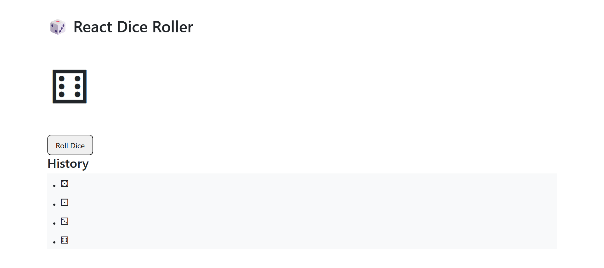

# 🎲 React Dice Roll Simulator  



Basit ve eğlenceli bir **Zar Atma Simülatörü**.  
Kullanıcı her tıkladığında zar rastgele (1–6 arası) bir sayı üretir ve kısa bir animasyonla sonucu gösterir.  
**React** ve **SCSS** kullanılarak oluşturulmuştur.  

---

## 🧩 Özellikler  
- 🎯 1–6 arası rastgele zar sonucu  
- 🌀 Zar atma animasyonu  
- 📜 Önceki atışların geçmişi  
- 💅 SCSS ile stillendirilmiş modern arayüz  
- ⚛️ React Hook’ları (useState) kullanımı  

---

## ⚙️ Teknolojiler  
- **React**  
- **SCSS**  
- **JavaScript (ES6+)**

---

## 🚀 Kurulum  

Projeyi yerel ortamında çalıştırmak için:  

```bash
# Depoyu klonla
git clone https://github.com/barzandavut/dice-roll-simulator.git

# Proje klasörüne gir
cd dice-roll-simulator

# Bağımlılıkları yükle
npm install

# Uygulamayı başlat
npm start
